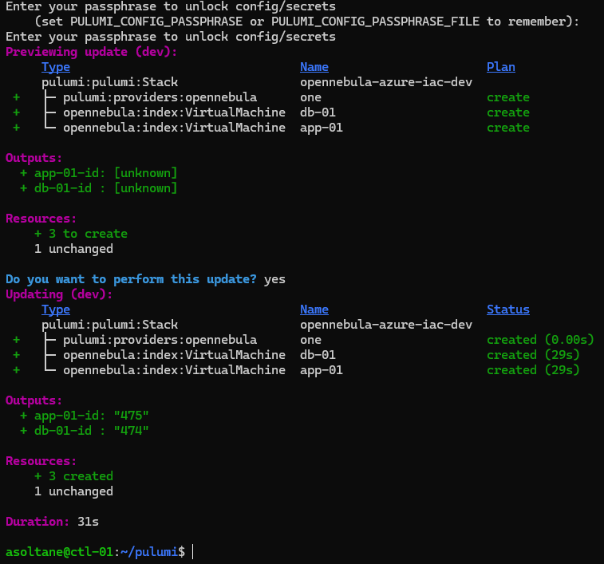
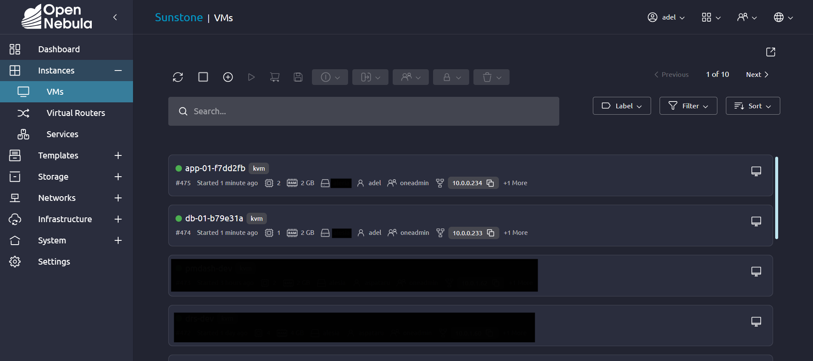
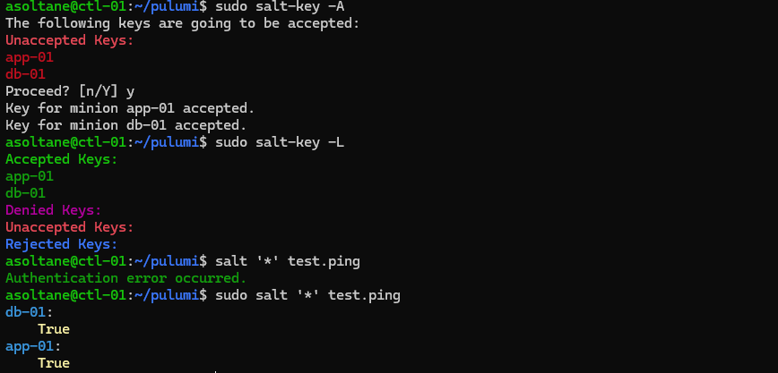
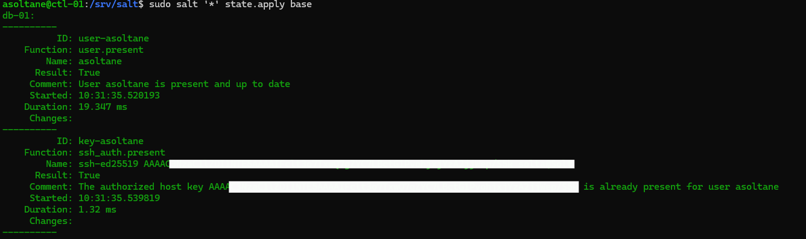
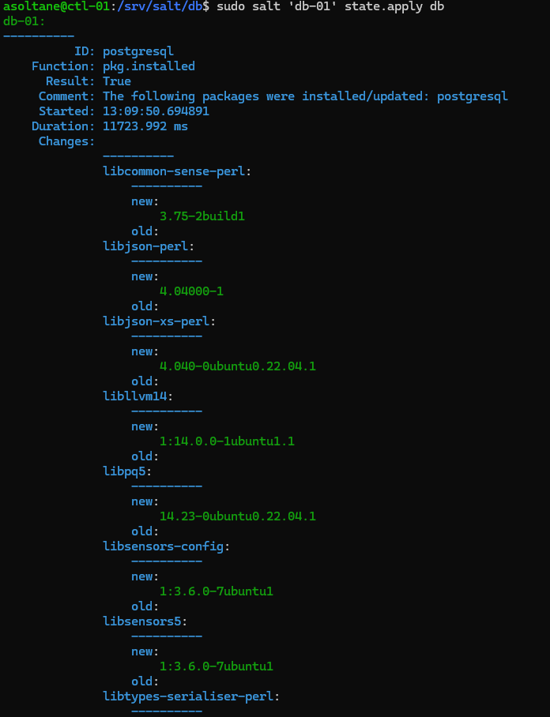
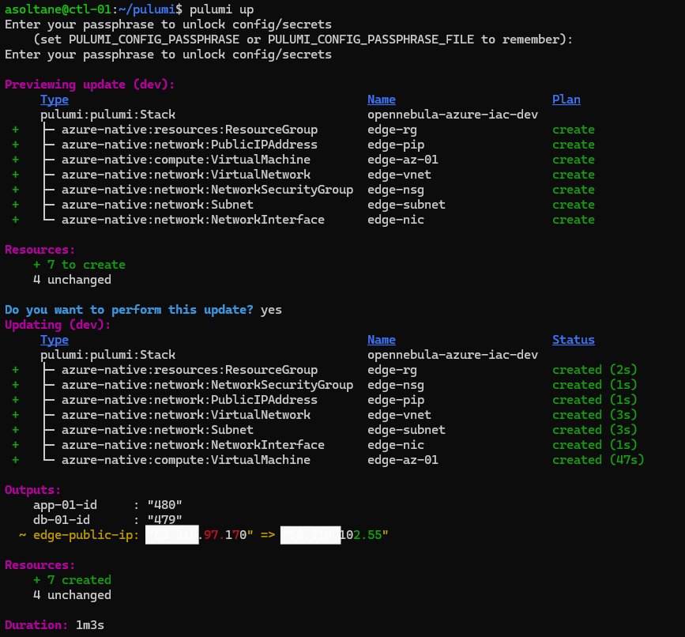
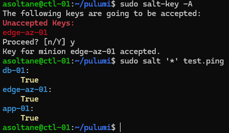
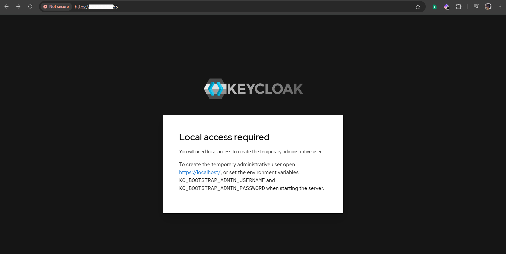

## Context

I started this project to learn two tools that caught my attention: Pulumi and SaltStack. I've been using Terraform and Ansible for a while and wanted to explore other options. Pulumi lets you define infrastructure in a real programming language (Go, in my case), while Salt is a configuration-management tool that I kept hearing about but hadn't used yet.

I run a production OpenNebula cloud on OVH, and I wanted to see how these two tools work in a real setup rather than a throwaway lab.

On OpenNebula I'm deploying an internal Keycloak instance for authentication and authorization, meant for potential use across our internal applications, with a PostgreSQL database on a separate VM to store the Keycloak data.

Since these workloads sit behind an OPNsense firewall with a public IP (that I want to keep private), I'm also deploying an Nginx reverse proxy on Azure (Edge Proxy) to take the incoming traffic and route it to Keycloak. The proxy reaches back to the internal Keycloak through a WireGuard VPN tunnel (managed by Salt). It also handles SSL termination, so users get a secure connection while Keycloak itself never gets exposed to the public internet.

## Infrastructure Architecture

```
            Internet
               │ https (443)
        ┌──────▼───────┐
        │  edge-az-01  │  Azure — nginx TLS reverse proxy (Salt role: edge)
        └──────┬───────┘
               │ WireGuard tunnel (Salt-managed)
 ══════════════╪══════════════  OPNsense: WG + Salt 4505/4506, source-restricted
               │
   OpenNebula / KVM (OVH)
   ┌───────────▼──────────┐     ┌────────────────────┐
   │  app-01 · Keycloak   │────▶│ db-01 · PostgreSQL │
   └──────────────────────┘     └────────────────────┘
   ┌──────────────────────────────────────────────────┐
   │ ctl-01 · Salt master + reactor + Pulumi program  │  (the one hand-made VM)
   └──────────────────────────────────────────────────┘
```

### Provisioning: Pulumi

The Pulumi program instantiates two VMs on OpenNebula from a template (`Ubuntu-20.04-Base`), one for Keycloak, one for PostgreSQL, and one VM on Azure, where it also creates the resource group and virtual network.

### Bootstrap (important step)

When a VM first boots, a bootstrap script installs the Salt minion, tags the VM with its role, and points it at the Salt master so the two can talk over the secure bus. This is the handoff: Pulumi's last job is injecting the bootstrap, and Salt takes over from there, Pulumi never touches the VM again.

### Configuration: SaltStack

The Salt master accepts the minion connections and manages the Keycloak and PostgreSQL VMs from there. Salt also manages the WireGuard tunnel between the Azure Nginx proxy and the internal network, keeping the traffic between the two environments encrypted.

### Control Plane

This VM is created manually, as a one-time setup, and hosts the Salt master, the Pulumi program, and the Salt reactor. It's manual on purpose: the tool can't provision the machine it runs on. The reactor automates actions based on events happening across the infrastructure, for example, re-applying a config when someone changes a watched file.

### Engineering Decisions

OpenNebula has no Pulumi provider, so I bridge the community Terraform provider: Pulumi reads its schema and generates a typed Go SDK from it. No Terraform binary and no HCL end up in the workflow, I just import the generated SDK in my Go program. Usually I run ``ònetemplate instantiate`` manually with the OpenNebula Frontend's XML-RPC API, now The Pulumi provider will do the same by connecting to OpenNebula 's XML-RPC API directly (https://<frontend>:2633/RPC2)

I put the reverse proxy on Azure to keep Keycloak and its database isolated from the public internet. Only the stateless proxy is exposed; the identity and data layers stay on the private cloud.

Secrets are handled in two places. Cloud credentials (the OpenNebula API user/password, etc.) live in Pulumi's stack config, encrypted at rest so the config file is safe to commit. In-guest secrets (the database password, Keycloak admin, WireGuard keys) live in Salt's GPG-encrypted pillar, the master decrypts them and hands each minion only its own, so nothing sensitive is ever stored in git in plaintext.

Split master address for a hybrid setup. The Salt minions don't all reach the master the same way. db-01 and app-01 sit on the same internal vnet as the control plane, so they reach the master directly on its private address (10.0.0.19). The Azure edge is outside that network, so it reaches the master through the OPNsense public IP, where ports 4505/4506 are forwarded and source-restricted to the edge's IP. I kept both values as separate Pulumi config keys (masterAddrInternal / masterAddrPublic) and the bootstrap picks the right one per VM at provision time.


Reaching the OpenNebula API from ctl-01 (due to strict OpenNebula firewall rules, the XML port 2633 is only open to the localhost). So though I would create a connection between the Pulumi program and the OpenNebula API, with a Remote Forward Tunnel. 
The ctl-01 (where Pulumi runs) sits inside the private vnet and has no route to the
OpenNebula API on the frontend. Only my laptop can reach both sides, so I use a
reverse SSH tunnel to plant the API on ctl-01's localhost:
```bash
ssh -A -R 2633:<frontend>:2633 -J <user>@<bastion>:<port> <user>@<ctl-01>
```

Then Pulumi points at it locally:

```bash
pulumi config set one:endpoint http://localhost:2633/RPC2
```

A `-R` (reverse) forward instead of `-L` because the connection has to start from the
laptop, the one host with reach, not from ctl-01.


## SetUp details

#### Step1: Ctl-01 (Salt master + Pulumi program + Salt reactor)

Instantiated a VM from the `Ubuntu-20.04-Base` template (since Pulumi can't provision the machine it runs on), with 2 vCPU, 4GB RAM, 50GB disk. Pulumi and Salt are installed on it, and the Pulumi program is cloned from this repo.

Pulumi Backend choice: I use the local backend, which stores the state file in ~/.pulumi. 

Note: I access the Ctl-01 VM  which is behind the OPNsense firewall through SSH with PKI (OPNsense translates the public key to an internal Bastion VM through highport NAT, so from that node I ssh to the Ctl-01 on the local vnet). 
ssh -A <high-port>  adel@<public-ip>

#### Step 2: OpenNebula prep

Created a dedicated OpenNebula user for Pulumi instead of using oneadmin (never), with USE rights only on the `Ubuntu-24.04-Base` template, its image, and the vnet. Automation gets its own least-privilege identity, so anything Pulumi does is traceable to that user and can't touch the rest of the cloud.

Exported the template for reference so the repo is self-contained:
`onetemplate show -x <id> > templates/ubuntu-24.04-base.yaml`

The OpenNebula credentials for this user are stored as Pulumi secret config (`pulumi config set --secret`).

#### Step 3: Pulumi project scaffold and OpenNebula SDK generation

In this would sset up Pulumi config locally and hood the OpenNebula Terraform provider to generate a Go SDK. The Pulumi config includes the OpenNebula API endpoint, the dedicated user credentials, and the Azure credentials. Setting the Master addresses (Internal/Public).


#### Step 4: Bootstrap & minion configuration

Each VM boots with a bootstrap script that Pulumi injects through the OpenNebula START_SCRIPT_BASE64 context field (base64-encoded so the context parser doesn't mangle it). The script is deliberately minimal: it installs the salt-minion, writes the master's address into the minion config so the VM dials home, and tags the VM with its role grain. Everything past that is Salt's job. 
I also used to run manual a script to create sudo users and inject public keys is now the base/users.sls state.


#### Step 5: Provision db-01 and app-01 with Pulumi
db-01 and app-01 are instantiated from the template. They're defined as a Go slice of specs, so adding a machine is adding a struct, not copy-pasting a block. Each boots with a bootstrap script (injected via OpenNebula contextualization) that installs the Salt minion, sets its role grain, and points it at the master.


#### Step 6: Installing SSalt and setting up the master

Installed the Salt master on ctl-01, pointing `file_roots` and `pillar_roots` at
`/srv/salt` and `/srv/pillar`. Set `interface: 0.0.0.0` so minions on the vnet can reach
the bus on 4505/4506.

Note:  Minions first came up with no hostname, so they registered as `localhost` instead
of their names. Fixed in the bootstrap: set the hostname and write `/etc/salt/minion_id` explicitly before installing the minion, so each VM registers by its role name automatically.

#### Step 7: Base Workloads hardening formula

A `base` formula applied to every minion, split into three states pulled together by
`base/init.sls`:
- **users**: named users, their SSH keys, and sudo, all defined in pillar. This
  replaces the manual script I used to run by hand to create users and inject keys.
- **ssh**: root login and password auth disabled, key-only access.
- **firewall**: nftables with a default-deny inbound policy, SSH allowed.

Config is templated and pushed with `file.managed`, and services restart only when
their config actually changes (`watch`).

#### Step 8: Pillar and secrets

Pillar holds per-minion data served by the master. Non-secret values (users, db host,
versions) are committed. Secrets go in one file, `secrets.sls`, which is gitignored; a
committed `secrets.sls.example` shows the keys without the values. Each minion only
ever receives its own pillar.

Plaintext + gitignore is the current approach. The GPG-encrypted pillar route (which
lets the secrets file itself be committed) is parked on the `feature/gpg-pillar` branch
to finish later (I had many issues making the Salt decrypt the secrets with the GPG key).

#### Step 9: Adding Salt Roles (DB, Keycloak) 
Note: Ill get to the Edge proxy later.

Salt would ùmanage the DB content, DB users, and Keycloak configuration. The DB state creates the database, user, and schema, and injects the password from pillar. The Keycloak state installs the server, configures it to use the DB, and sets up the admin user with its password from pillar.

Keycloak from the release tarball (verified by checksum), non-root systemd service, config templated from pillar. proxy-headers=xforwarded so it trusts the edge proxy's headers, since TLS terminates there.

#### Step 10: Provisionning Azure edge with Pulumi

The same Pulumi program provisions the edge on Azure, resource group, vnet, subnet, NSG, public IP, NIC, and the VM. I will be reusing the exact bootstrap template as the OpenNebula minions, only with role `edge` and the master's public address. 

The NSG allows SSH (from my IP) and HTTPS, but no Salt ports, the minion dials out to the master, nothing dials in. The master is reached through an OPNsense port-forward (4505/4506 ==> ctl-01), source-restricted to the edge's public IP.

Region and size were constrained by the subscription (I have Azure for Students), not by choice: the subscription's
Azure policy only allowed `austriaeast`, which offers only v2 burstable sizes (the common `B1s` isn't available there) and a Dynamic PubIP.

#### Step 11: WireGuard tunnel (Salt-managed)

Salt configures both ends of a WireGuard tunnel between app-01 (Keycloak) and the Azure edge, from a single template that branches on the `role` grain, each host renders its own interface and peer from the same file. Private keys come from the gitignored secrets pillar; public keys and endpoints from normal pillar. The tunnel gives a 10.30.0.0/24 overlay (app-01 = .1, edge = .2), so all edge ==> Keycloak traffic rides inside it and authentication never crosses the public internet in plaintext.

Two things that had to be right for it to actually pass traffic, not just handshake:
- The peer endpoint needs `IP:port`, not a bare IP, or wg-quick fails to parse.
- The base firewall default-drops inbound, so the tunnel handshaked but ICMP/data were
  dropped until I added `iifname "wg0" accept` to nftables


#### Step 12: edge role (nginx TLS reverse proxy)

nginx on the edge terminates TLS and reverse-proxies to Keycloak at 10.30.0.1:8080 through the WireGuard tunnel. It forwards the `X-Forwarded-*` headers that Keycloak is configured to trust, so Keycloak builds correct HTTPS redirect URLs even though TLS terminates one hop earlier. 


## Running The Project

First let's fireup our OpenNebula API Tunnel (check the Key Engineering Decisions section for details):

```bash
cd pulumi
pulumi up          # provisions of the VMs on OpenNebula
```



Successfully deployed on the Sunstone OpenNebula cloud, with the two VMs (db-01 and app-01) running and reachable from the Salt master. The Salt minions are connected to the master and ready to receive configuration.



Then we should accapt the minions Keys on the Salt master after Pulumi provisions the VMs:

```bash
salt-key -A            # accept the new minions on the master
sudo salt '*' test.ping     # confirm both respond
```




Apply the base hardening to all minions( this creates named users with their public keys injected for ssh access, and disables password login, locking down ssh to key based aithentication only, and nftables to deny inbound by default, allowing only the Salt bus and WireGuard traffic and ssh):

```bash
sudo salt '*' state.apply base
```

Example output:




Apply pillar changes (pillar is compiled by the master, so refresh it on the minions):

```bash
sudo salt '*' saltutil.refresh_pillar
```

Check a minion sees its pillar and a specific value:

```bash
sudo salt 'db-01' pillar.items
sudo salt 'db-01' pillar.get db_password
```

Would want to emphisize on how the Salt roles works, so after defining the DB role in pillar, we can apply the DB state to the db-01 minion:

```bash
sudo salt 'db-01' state.apply db
```


Provision the edge (runs alongside the OpenNebula VMs):

```bash
pulumi up
```



Accept the new minion and confirm all three respond across both clouds:

```bash
sudo salt-key -A
sudo salt '*' test.ping
```



Bring up the tunnel (both peers must be up):

```bash
sudo salt -L 'app-01,edge-az-01' state.apply wireguard
```

Verify handshake and connectivity through the tunnel:

```bash
sudo salt 'edge-az-01' cmd.run 'wg show'
sudo salt 'edge-az-01' cmd.run 'ping -c2 10.30.0.1'
```

Deploy the proxy:

```bash
sudo salt 'edge-az-01' state.apply edge
sudo salt 'edge-az-01' cmd.run 'nginx -t'
```

Bringing the full path up surfaced the usual layered failures, each fixed at its own layer: 
** 443 had to be opened in the edge firewall; Keycloak's pillar `db_host` pointed at the wrong node
** PostgreSQL only listened on localhost and had to bind the vnet address with a matching `pg_hba.conf` rule and a firewall opening on 5432

Then open `https://<edge-public-ip>` the Keycloak login page loads over the tunnel.

